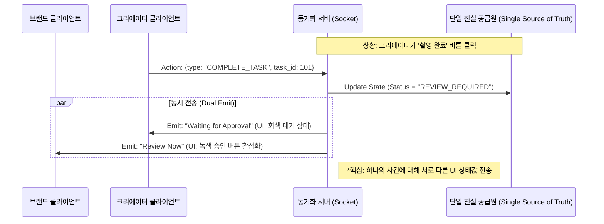

# 발명 제안서 (Invention Disclosure Form)

### 1. 발명의 명칭 (Title of Invention)
**국문**: 일정 데이터의 상업적 가치 평가 및 제안 객체 자동 생성 시스템 및 그 방법
**영문**: System and Method for Evaluating Commercial Value of Schedule Data and Automatically Generating Proposal Objects

### 2. 발명의 배경 및 목적 (Background & Objectives)
#### 2.1 종래 기술의 문제점 (Problems in Prior Art)
*   일정 관리와 상업적 제안의 분리, 기회 손실, 협상 비효율.
*   **협업의 비대칭성 부재**: 기존 협업 도구(Google Docs 등)는 모든 사용자에게 동일한 화면과 권한을 부여하여, '협상(Negotiation)'이라는 특수한 비대칭적 상황(갑/을 관계, 가격 비공개 영역 등)을 지원하지 못함.

#### 2.2 본 발명의 목적 (Objective)
1.  **[제1발명] 모먼트 엔진**: 일정 데이터를 상업적 제안 객체로 자동 변환.
2.  **[제2발명] 통합 워크스페이스**: 단일 제안 객체에 대해 브랜드와 크리에이터에게 **서로 다른 권한과 뷰(View)를 제공**하며 실시간 동기화.

### 3. 발명의 구성 및 특징 (Configuration & Features)

#### [제1발명] 모먼트-투-상업화 엔진 (Moment-to-Commercialization)
*(기존 모먼트 엔진 내용은 유지하면서 독립적인 기술로 서술)*
*   **핵심**: 일정(Duration, Type) -> 슬롯(Slot) 자동 생성 -> 단가(Price) 자동 매핑.

#### [제2발명] 비대칭 상태 동기화 워크스페이스 (Asymmetric State Synchronization)
*이 기술은 제1발명과 결합될 수도 있고, 독립적으로 사용될 수도 있음.*

**3.4 통합 워크스페이스 아키텍처**
*   **Dual-View, Single-State 구조**:
    *   데이터베이스에는 하나의 `Proposal` 객체만 존재함.
    *   그러나 서버는 요청자의 `Role` (Brand vs Creator)에 따라 전혀 다른 JSON 데이터를 내려줌.
    *   **브랜드 뷰**: `Outcome` (결과물) 위주, `Payment` (결제) 버튼 활성화.
    *   **크리에이터 뷰**: `Task` (할일) 위주, `Payment` 버튼 비활성화, `Payout` (정산) 정보 표시.

**3.5 핵심 처리 흐름도 (워크스페이스)**

### 4. 청구 범위 전략 (Claim Strategy - 중요)
**변리사님께: 본 발명은 두 가지의 독립적인 기술 사상을 포함하고 있습니다. 반드시 청구항을 분리하여 작성해 주십시오.**

*   **[대분류 1] 모먼트 엔진 독립항**: 일정 데이터를 제안 객체로 변환하는 기술 그 자체. (워크스페이스 기능이 없더라도 침해 성립되도록)
*   **[대분류 2] 워크스페이스 독립항**: 이종(Dual) 클라이언트 간의 비대칭 상태 동기화 기술. (모먼트 엔진이 없더라도 침해 성립되도록)
*   **[종속항]**: 두 기술이 결합된 전체 시스템.

### 5. 발명의 효과 (Technical Effects)
1.  **데이터 자산화**: (모먼트 엔진) 시간의 상품화.
2.  **협업 효율성**: (워크스페이스) 이메일, 전화 없이 플랫폼 내에서 비대칭 협상 및 계약 완결.
